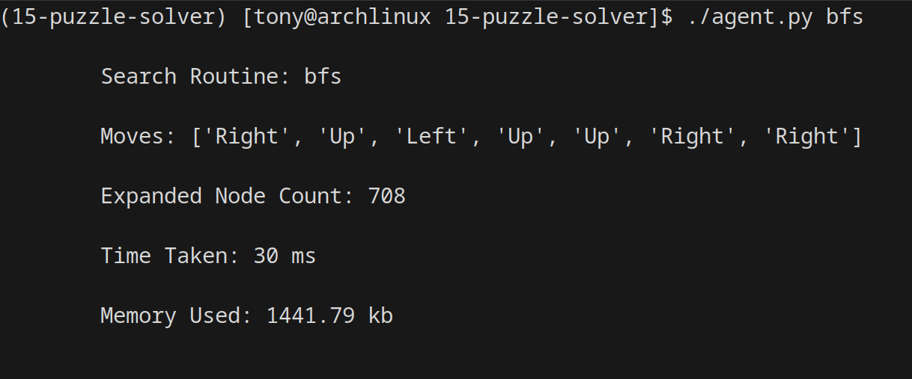
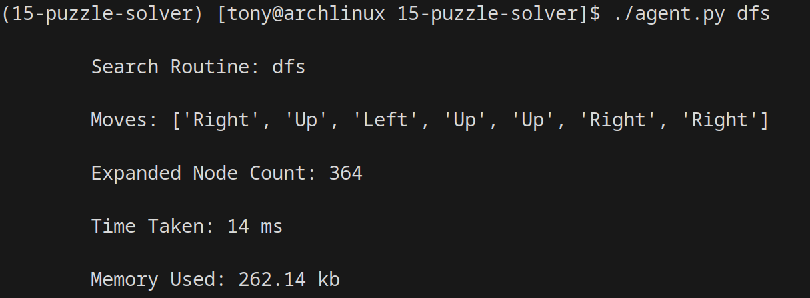
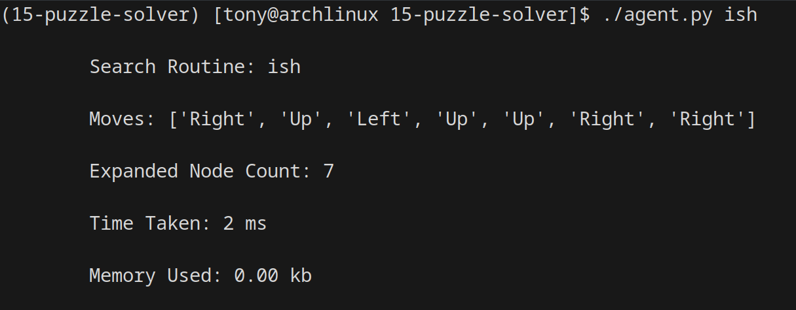

# 15-Puzzle Solver Report
### Tony Griffin
### CS 480, Spring 2024
### February 6, 2024

# Breadth-First Search
For breadth-first search, I utilized a standard queue for the frontier.
This expanded all nodes of a common depth first before expanding the next level
of depth. This was moderately efficient, outperforming the depth-first
search but falling well behind informed search. The expansion takes place
in the following order: Up, Down, Left, Right. Given this expansion,
this routine expands 708 nodes in approximately 48 milliseconds. The
memory requirement for this routine is 1441.79 kb. The move output is the
same as informed search even with the extra expansions.

## Screenshot

# Depth-First Search
For depth-first search, I utilized a LIFO queue (stack) for the frontier.
This expanded all the nodes of a certain path before going back a node and
expanding it. Without a bound, this program ran until their was no more memory
left to allocate, still with no solution. To combat this, I placed a bound of
16 on the depth. This was selected because there are `16!` possible states for
the board to be in and this gave depth-first search plenty of nodes to
expand. The expansion takes place in the following order: Up, Down, Left,
Right. Given this expansion and bounding, this routine expands a massive 6503
nodes and takes up 266 milliseconds. The memory requirement to run this
routine is 8388.61 kb.

If I were to limit the depth counter to 7 (what we know to be the optimal
depth), the expansion would only use 364 nodes, 17 milliseconds, and
262.14 kb. With this foresight into the optimal depth, the depth-first search
would then outperform breadth-first search in every metric (while resulting in
the same steps) by limiting the number of "wrong" steps the agent can make
down the "incorrect" path.

## Screenshot

# Informed Search
For informed search using heuristics, I designed the function to output the
number of misplaced tiles given a current board state relative to the goal
state. The list of moves utilized was the same as bread-first search; however,
their efficiencies varied drastically. This routine was highly efficient,
generating only seven nodes in total and using less than a kb in total
memory used. The time for such a routine averaged only 5 milliseconds.
The problem domain aided in this efficiency as each move throughout the
process had a different heuristic number, removing the possibility of
expanding the "wrong" node and leading to an optimal solution.

## Screenshot

